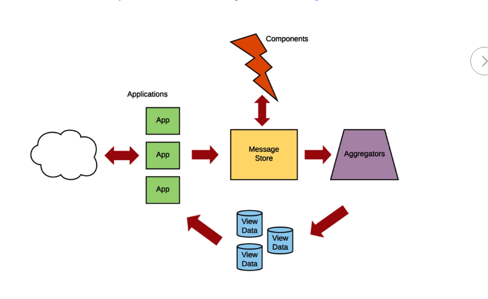
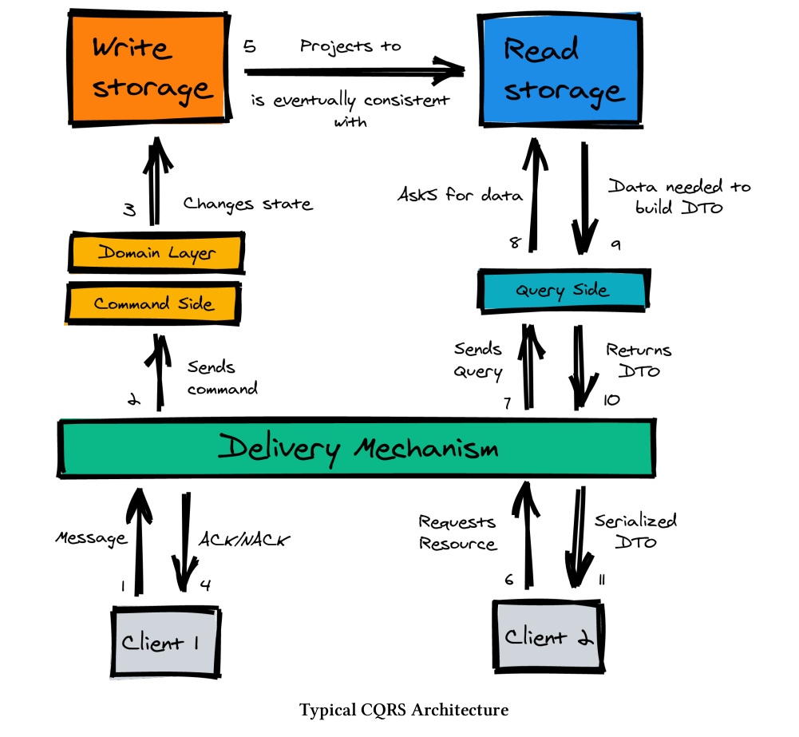
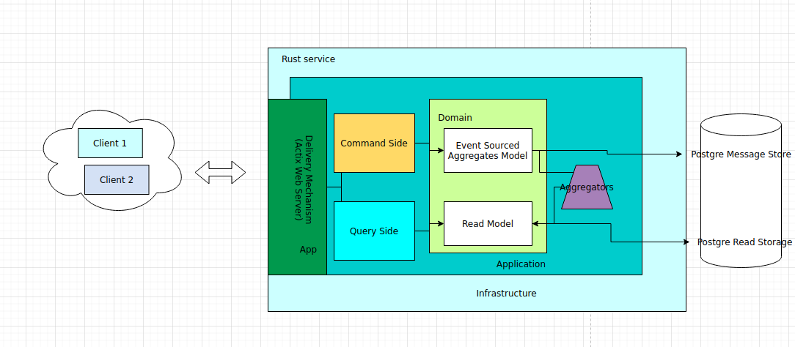

# CQRS + Event Sourcing example

I am going to show you a possible approach to Event Sourcing and CQRS with rust.

This is a service that I am going to use in an ecosystem of services for my personal
project. This service will deal only with identity. The one and only requisite
at the first stages will be to be able to log in.

Logging in = Post with an email + password to the service. The service will verify
the password, return an unauthorized response or an accepted with a generated JWT.

In order to be able to do that, there is another needed functionality, that one
of registering users.

The service will have a CQRS+ES+hexagonal architecture. It's written in Rust. And I
want to accompany you all the way to deploying this to production.

The final repository is this one: [https://github.com/eniltrexAdmin/crappy-user]
(https://github.com/eniltrexAdmin/crappy-user)

## Big disclaimer (please read)

I come from a high level language very OOP such as PHP. Not that using Rust scares
me, after all, I have been using here and there other languages. But I am not very
used to the advantages of functional programming, and I might inadvertently favor
OOP approaches for some stuff where it might make more sense to use functional 
programming. Not to say that Rust doesn't have inheritance, and uses composition, and 
other paradigms new to me. (Traits in PHP often scare me for the extra cognitive load
and for the huge misuse of them I had the unlucky privilege to witness). So if you see
something like "this doesn't look like Rust at all", blame my ignorance 
(you can always point that out in a comment).

I have been hesitating whether to write this series of blogs while
developing or when it's almost in the final stage. I have decided to write it while
I am developing. 

At the moment of writing that, I just have finished the logging in action, so it's
quite advanced but not yet finished. There are some changes and features I will add.
Those feature being the ability to activate a user, and deactivate, know when was
the last time a user logged in and other non MVP action.

So take into account that most likely I will come back and revisit many sections
of the code I am showing. I might leave for later the dealing of some problems, and
you will see some genuine doubt and maybe -most probably- pain.

I hope you get some entertainment out of it, but above all, I hope that you get important
insights. About how important it is to have a clear architecture
in your head while developing. I hope that you develop some sense of opinion. One where you
can even argue the stuff I am doing here and find even better ways than the ones I 
am showing. (please tell me when you do).

If you are still here reading this, thank you.

## Previous knowledge

You need to know a of the Rust ecosystem. As a beginned myself to Rust, I 
appreciated greatly greatly greatly this book: 

[https://www.zero2prod.com/index.html](https://www.zero2prod.com/index.html)

I have based my projects on a mix between this book and "regular" hexagonal
architecture approach. I am still myself figuring out some pieces. And this book
is a great help.

## Scaffolding

Let's start with the base of our repo. You may clone this base project:
https://github.com/FrancescJR/rust-actix-basic-miro 

I am honestly not positive that this repo doesn't have any problem, but we will go 
through each bit on its own time.

This repository sets the base for our infrastructure: Actix for our web server and
web framework. PostgreSQL for our database.

## Architecture

This deserves its own blog post. The options and nuances are almost limitless. The
programming language to be used also affects clearly on the decision-making.

On this project you will see a mix of Ethan Garofolo's "[Practical Microservices:
Build Event-Driven Architecture with Event Sourcing and CQRS](https://www.amazon.com/gp/product/B0899K5R4P/ref=kinw_myk_ro_title)"
with some reference
PHP repositories: https://leanpub.com/cqrs-by-example
(https://github.com/dddshelf/cheeper-ddd-cqrs-example )and with the CQRS-ES Rust
Crate  with this awesome documentation: [https://doc.rust-cqrs.org/](https://doc.rust-cqrs.org/)

Ethan Garofolo book is with Typescript, and it relies heavily on a project called
[Eventide](https://eventide-project.org/) that offers some specific software when working with an Event Sourcing
paradigm. More precisely, it uses Eventide's Message-db on the infra layer (not that
he calls the infra layer infra layer), a wrapper for a message store supported on a 
PostgreSQL DB. Message-db has all the functions you will need for your message store.

Ethan's Garofolo's book architecture looks like this: (I hope I am not
getting into copyright trouble for sharing this picture, this comes from the book):

In our project though we are not going to follow the exact same pattern.

There is a big difference in what will be our project and it is that we won't
save Commands in our message store. Commands will be generated on demand by our
application and executed synchronously. Less subscriptions and less infra to 
maintain, but we loose that, the option to execute those asynchronous.
It is something I would like to do at some point, probably when I redo this project
in Go, and when the deployment to production will be with lambdas (for this one
I have in my head to deploy that to an EKS, even though it's a little bit expensive
for a self-hosted project).

What I really like on this architecture is the especial mention of the Aggregators.
In the projects I have seen in PHP, those are kind of "on the fly", updating
view data as soon as a single message gets queued in the internal application' event
bus. Yes, there are "workers" and so on, but somehow, feels like a missing
piece all together.

The same way I'd like to try to have Command separately, I would like also to have
the execution of Aggregators asynchronously. I will try that, but I am afraid it is
easier to have them synchronously, the way I have seen in other projects. I am
quite sure Rust can help here, and event in the same application, I can have
the full ecosystem related to a single bounded context (identity in this case)
living in a single machine/service + being it asynchronous. 

Well, enough deviating. Since I really like the concept of aggregators, I am 
going to promote them to the same category as command handlers. There's a big deal
to say about them, but let's wait until we see them in more detail in the following
posts.

Going back to the full architecture picture, in our case, Components and App
are kind of the same place. Actually, we are going to follow something more
similar to that:

Not that is that different, after all, it's not that different. We can
translate both architectures to a single one, which is the one I will use:

I have tried to use the same colors. There's nothing actually. I am just
trying to add the hexagonal architecture layers in here.

Requests will touch our endpoints. The Apps in Garofolo graph, the Delivery
Mechanism in the typical graph. Those requests will be directed either
to the command side to a command handler, or to a query handler.

Commands will generate domain events, that will be persisted in our Message
Store.

Aggregators will be triggered to generate
the view data. Not any view data, the view data according to our read model.
The read model will be "queryable" also by our application later, by requests
that want to query.

Now, the aggregator part is a big part. On the typical graph there's a worker.
I am sure Rust offers some tool to make this 
process asynchronous. Ideally, we could generate our view data from
zero every time, and this is something I am eager to try out, also to have
some temporal view data up to a point in time. Those are functionalities that
are available with event sourcing.

The other big part in this architecture is that it's all a big service. We will
program in a way that will be easy to break it into independent pieces, and by that
I mean that each piece might have it's own infrastructure. Each piece being
the command handlers from one side, the query handlers from the other, and the
aggregators as the last side. (As you can guess, the aggregators will be
the first ones to try out, and depending on the result of the experiment we might
proceed further).

Now I don't recommend
that on the first step. It's good to have all the domain logic regarding one
[bounded context](http://ddd.fed.wiki.org/view/bounded-context)  in a single
place. We will see how to break that into smaller pieces later, and whether
it's worth it.

We will also try to change the storage for both the message store to use eventually
Redis, and for the view data, to use Elastic Search.

### Message store

The message store is the central piece for an event sourced system. Such as Eventide's
message-db, there are many implementations for a typical message store. After all
we are just saving messages normally in a serialized format, so the problem for
'normalizing' the data (if my memory doesn't betray me, that's the process of
converting the UML schema to a relational DB schema) doesn't exist here. Not for 
the Command part at least.

Since we are just saving messages, we just need a way to retrieve them and that's it.
Message stores will have the concept of a stream, and all events will be saved in 
such a stream, so it's easy to retrieve the events, in order, of one specific stream.
Now here is where message store implementation differ from one another, but in general
there's no need to be picky about that.

I couldn't find any default implementation of Message Store for Rust. Implementing
a message store is something that can be totally delegated to a third party library.
The closest thing I found in Rust was this: https://doc.rust-cqrs.org/

It's a great crate, and honestly, you could finish the project I am doing here
probably in 1/4 of the time, if I just followed the framework. But here's the 
problem, this framework creeps on all the hexagonal architecture, in all the 
stages. I depend 100% fully on that, if I wanted to put a different DB engine
for a message store different than the ones implemented there I could have not.

Also the framework goes all the way to my domain, and where I could see it was a no-go
was when I had trouble unit testing my domain. I had to deal with infrastructure
concerns on unit tests about the domain. I couldn't find any work around (most likely
because of my sucky level of rust).

So I decided not to use it. But. A big but, I based many many things on that crate. 
Especially the implementation of the message store, it's just basically a copy paste
of their code. That's the only thing I wanted in the first place, I didn't want a full
framework, I just wanted an implementation of the message store. So I did my own, but
copying 90% of the code there. 

I changed a couple of things, that I might or might not
regret later, since I had the freedom to do so. Something about the sequence. You want
to retrieve events ordered, but adding a sequence number, in PostgreSQL, that
concept crept all the way to my domain. I believe the create solved it having
some kind of layer in the middle. I was lazy to add more stuff - I am still new 
to Rust!- so I decided to use a rather naive solution but simpler for that problem.

Still, there are very advanced Rust concepts in this create, and I am on the edge
of almost not understanding a couple of things, but so far, I didn't fall from the 
edge, I am still hanging on.

## Wrapping up

So we have more or less clear how are we going to deal with it all together.
On the next part, we will start with our domain. The cool thing about being
self-employed in this project is that I am myself the domain expert!

If you can't wait, you can check the repository (https://github.com/eniltrexAdmin/crappy-user)
[https://github.com/eniltrexAdmin/crappy-user], but re-read the 
disclaimer, it's not yet finished at the time of writing this.

See you next part!

